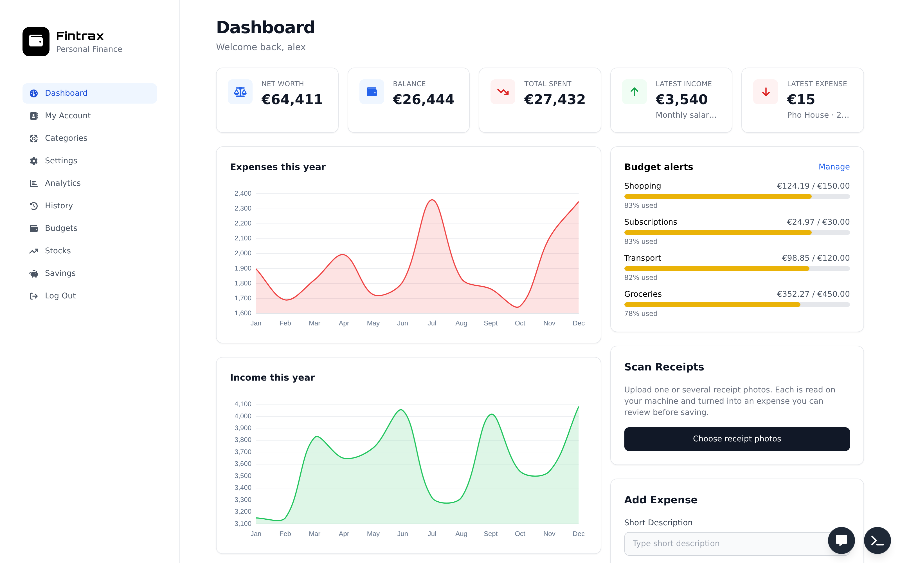
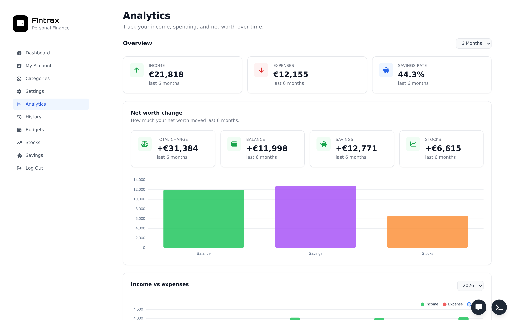
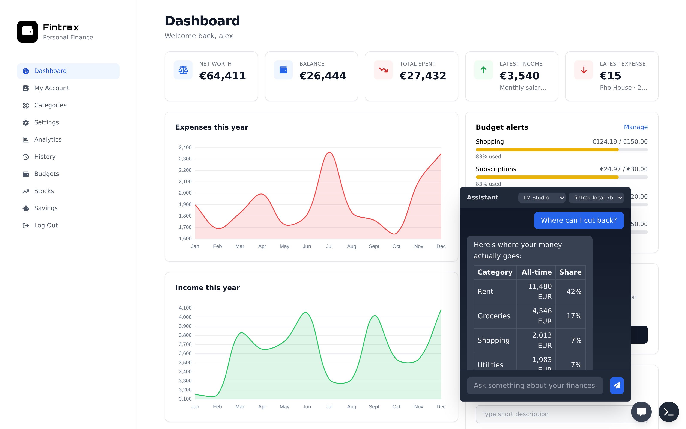
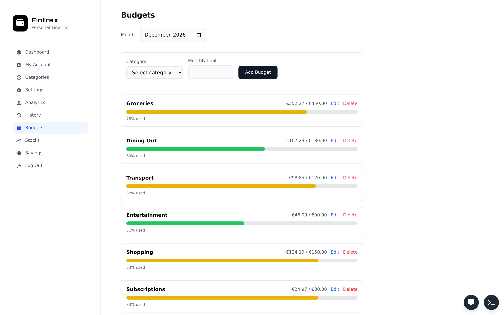
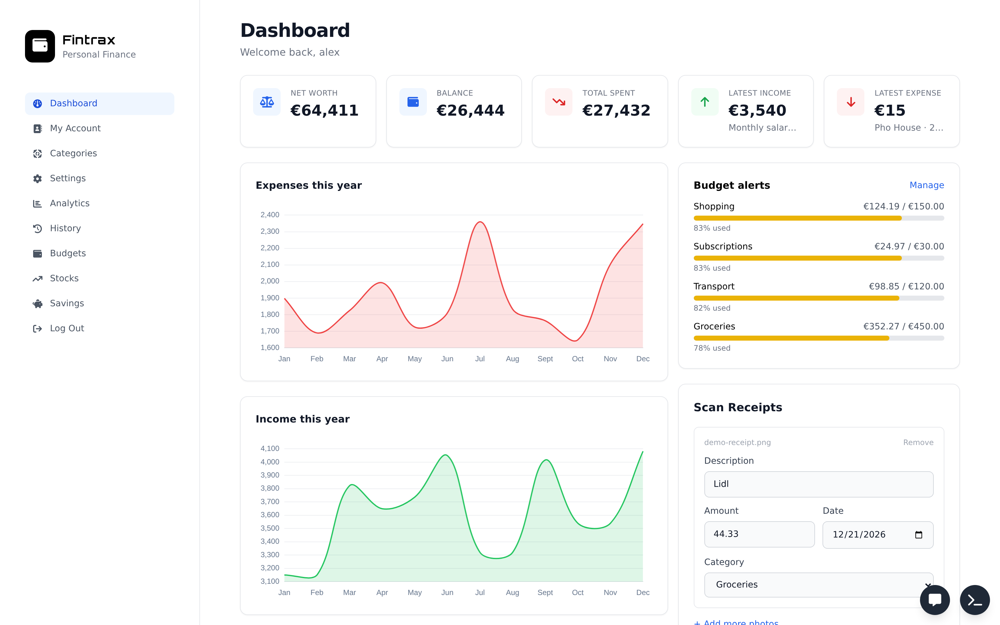
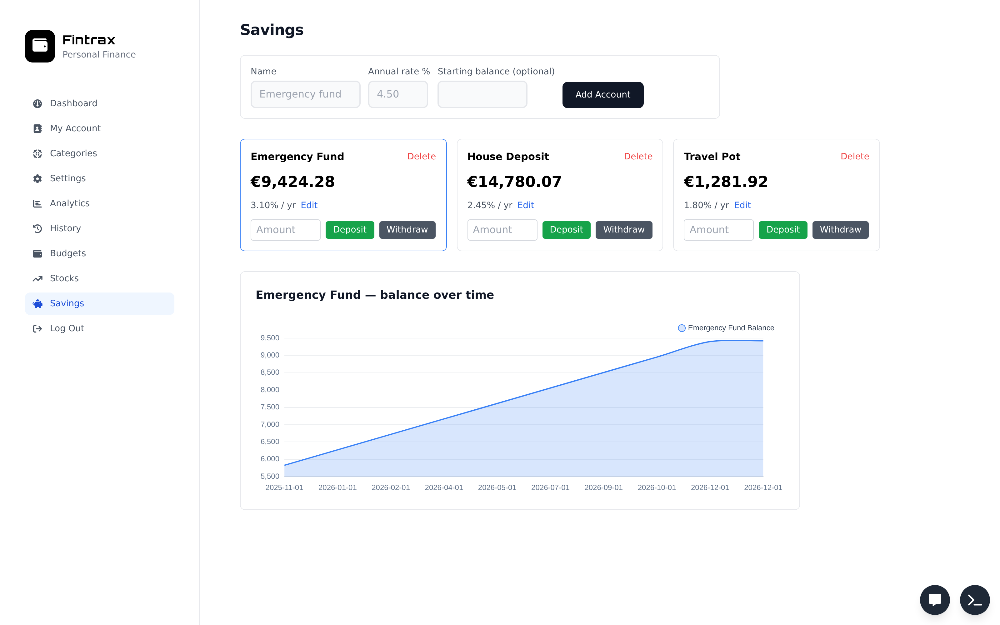

# Fintrax

**Local-first personal finance desktop app.**  
A Tauri 2 shell wrapping a Django/React app with an encrypted vault, AI assistant
(bring-your-own-key), Trading 212 sync, Telegram remote control — and zero cloud
subscriptions.



## Features

- **🔐 Encrypted vault** — master-password-protected envelope encryption for
  your API keys (OpenAI, Anthropic, Trading 212). Only you have the key.
- **📊 Complete ledger** — transactions, categories, budgets, recurring bills,
  savings accounts with interest accrual, multi-currency support (20 currencies).
- **📈 Analytics** — income/expense charts, category breakdowns, savings rate,
  net-worth tracking over time.
- **🤖 AI assistant** — ask questions about your finances in natural language.
  Bring your own API key (OpenAI, Anthropic, Ollama, LM Studio) or run fully
  offline.
- **📸 Receipt OCR** — snap a receipt with your phone camera; the app reads the
  total, merchant, and date and creates an expense draft.
- **📱 Telegram remote access** — check balances and add transactions from your
  phone. The bot connects over outbound-only long polling — no port forwarding
  or public URL needed.
- **📈 Trading 212 sync** — pull your portfolio automatically, FX-converted to
  your base currency.
- **💾 Local-first** — your data lives in a per-user SQLite database on your
  machine. No account sign-up, no cloud backend.

## Download

**No published binaries yet.** Releases will appear on the
[Releases](https://github.com/filipc96/finance-tracker/releases) page once the
first build is cut. See [BUILDING](#building-from-source) below to build
from source.

*⚠ The Windows installer will be unsigned — SmartScreen may show a warning.*
*Code signing may be added in a future release.*

- **Windows:** NSIS installer (.exe)
- **macOS / Linux:** not yet packaged (PRs welcome)

## Screenshots

| Dashboard | Analytics | AI Chat |
|-----------|-----------|---------|
|  |  |  |

| Budgets | Receipt scan | Savings |
|---------|-------------|---------|
|  |  |  |

> Screenshots were captured from a demo account with synthetic data. The receipt
> and AI chat responses used real app pipelines but staged test data — see
> [docs/screenshots/README.md](docs/screenshots/README.md) for details.

## Building from source

### Prerequisites

- **Node.js** 24+ & npm
- **Python** 3.13+ & pip (venv recommended)
- **Rust** & Cargo (latest stable)
- **Tauri CLI 2:** `npm install -g @tauri-apps/cli` or
  `cargo install tauri-cli --version "^2" --locked`

### Backend

```bash
cd backend
python -m venv .venv
source .venv/bin/activate          # Linux
# .venv\Scripts\activate           # Windows
pip install -r requirements.txt
python manage.py migrate
python manage.py runserver
```

### Frontend (development)

```bash
cd frontend
npm install
npm run dev          # starts Vite on :5173
```

The API runs on :8000, the Vite dev server on :5173. Open the Vite URL in your
browser — the API calls are proxied.

### Desktop build (Windows)

```powershell
pwsh desktop/build.ps1
```

See [desktop/build.md](desktop/build.md) for the full architecture and
iteration workflow. The script builds the React SPA, packages the Django
sidecar with PyInstaller, and produces an NSIS installer via Tauri.

## Quick start

1. Start the app → **Create an account** → set your base currency
2. Choose a strong master password (this is also your vault key)
3. **Save your recovery key** — the app shows it once on registration
4. Add transactions, set budgets, connect your AI provider or Trading 212
   account in Settings

> ⚠ This is beta-quality software. Back up your database regularly
> (`%APPDATA%\com.fintrax.app\db.sqlite3` on Windows).

## Documentation

- [Telegram remote setup & security](docs/telegram-remote.md)
- [Security & privacy](docs/security-privacy.md)
- [Build & release process](RELEASING.md)
- [Desktop architecture](desktop/build.md)

## Contributing

See [CONTRIBUTING.md](CONTRIBUTING.md).

## License

**MIT** — see [LICENSE](LICENSE). Bundled third-party dependencies (Django,
DRF, React, Tauri, and others) remain under their own permissive licenses.
